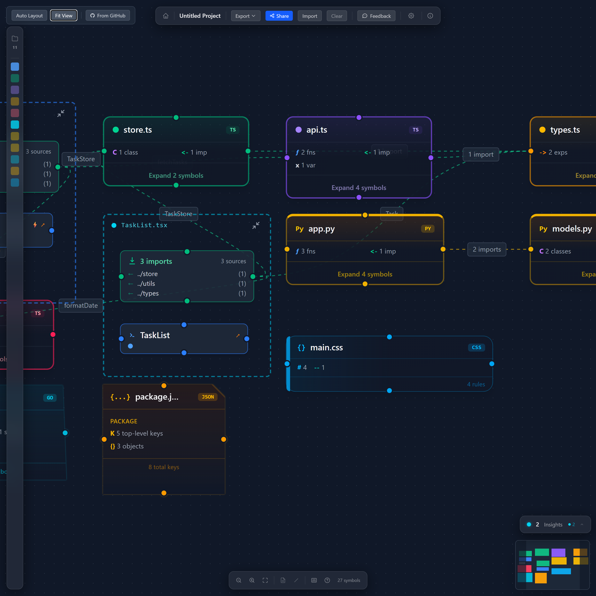

# NeedyNodes

**Your codebase, as an interactive map.**

Paste a public GitHub repo or drop your files — NeedyNodes parses them in your browser and renders an interactive dependency graph: functions, classes, imports, exports, and how they connect.

**Try it now → [needynodes.com](https://needynodes.com)** — free, no sign-up.

## Why

Reading an unfamiliar codebase file-by-file is slow. NeedyNodes gives you the aerial view first: which files matter, what depends on what, where the dead ends and circular flows are — so you know where to start reading.

## Features

- **GitHub import** — paste any public repo URL, pick the files, get a graph
- **Drag & drop** — or drop local files/folders straight onto the canvas
- **100% client-side** — your code never leaves the browser; no server, no uploads
- **Multi-language** — full symbol parsing for JavaScript, TypeScript, JSX/TSX, Vue, Svelte, Python, Go, and Rust; compact cards for CSS/SCSS/Less, HTML, JSON, YAML/TOML
- **Level-of-detail zoom** — small projects render flat, large ones cluster by folder; zoom out and files collapse into folder clusters
- **Insights engine** — flags unresolved imports, dead-end files, circular flows, oversized files, and deep dependency chains; copy them all as structured text for an AI handoff
- **Expand / collapse** — open a file card to see its functions, classes, and exports as individual nodes with cross-file edges
- **Shareable links** — share a canvas as a URL; export/import projects as JSON
- **Undo/redo, search & filter, keyboard shortcuts** — press `?` in the app for the full list

## How it's built

React 19 · TypeScript · Vite · ReactFlow · Zustand · Tailwind CSS 4 · @babel/parser for JS/TS AST parsing · custom regex parsers for Python/Go/Rust · dagre auto-layout. Parsing runs in a Web Worker; no tree-sitter/WASM, keeping the bundle small.

## About this repo

This repo is the public home of NeedyNodes — docs, roadmap discussion, bug reports, and feature requests. The app itself is a hosted service at [needynodes.com](https://needynodes.com) and its source is not (yet) open.

## Feedback & issues

Found a bug or want a feature? [Open an issue](https://github.com/linkanjj/NeedyNodes/issues) — feedback is very welcome.
